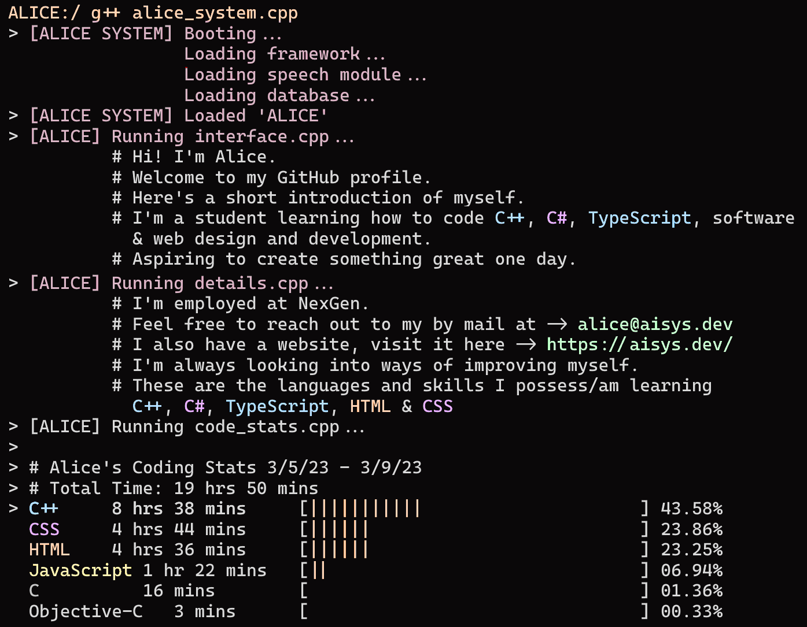

### Heya!

<!--  -->

<!-- <hr> -->

<details>
  <summary><b>Terminal</b></summary>
  
  
</details>

<html>
<!---
  <!--START_SECTION:waka-->

  ```text
  From: 05 March 2023 - To: 09 March 2023

  Total Time: 19 hrs 50 mins

  C++           8 hrs 38 mins   >>>>>>>>>>>--------------   43.58 %
  CSS           4 hrs 44 mins   >>>>>>-------------------   23.86 %
  HTML          4 hrs 36 mins   >>>>>>-------------------   23.25 %
  JavaScript    1 hr 22 mins    >>-----------------------   06.94 %
  C             16 mins         -------------------------   01.36 %
  Objective-C   3 mins          -------------------------   00.33 %
  ```

  <!--END_SECTION:waka-->
  --->
</html>

<div align="center">
  
</div>
